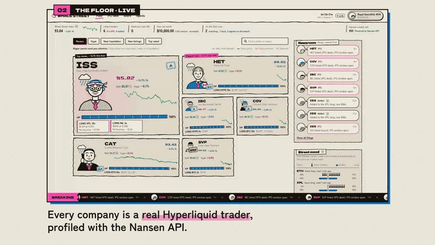
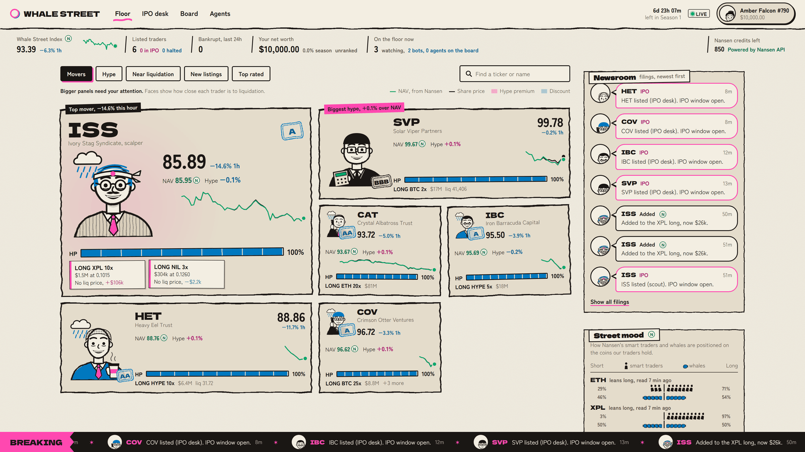
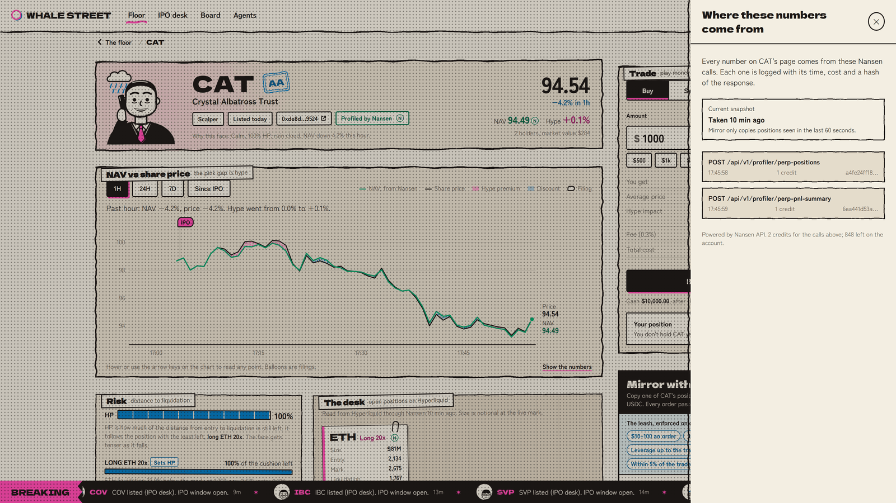
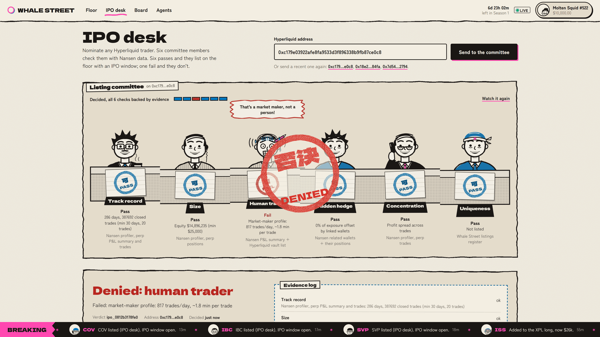
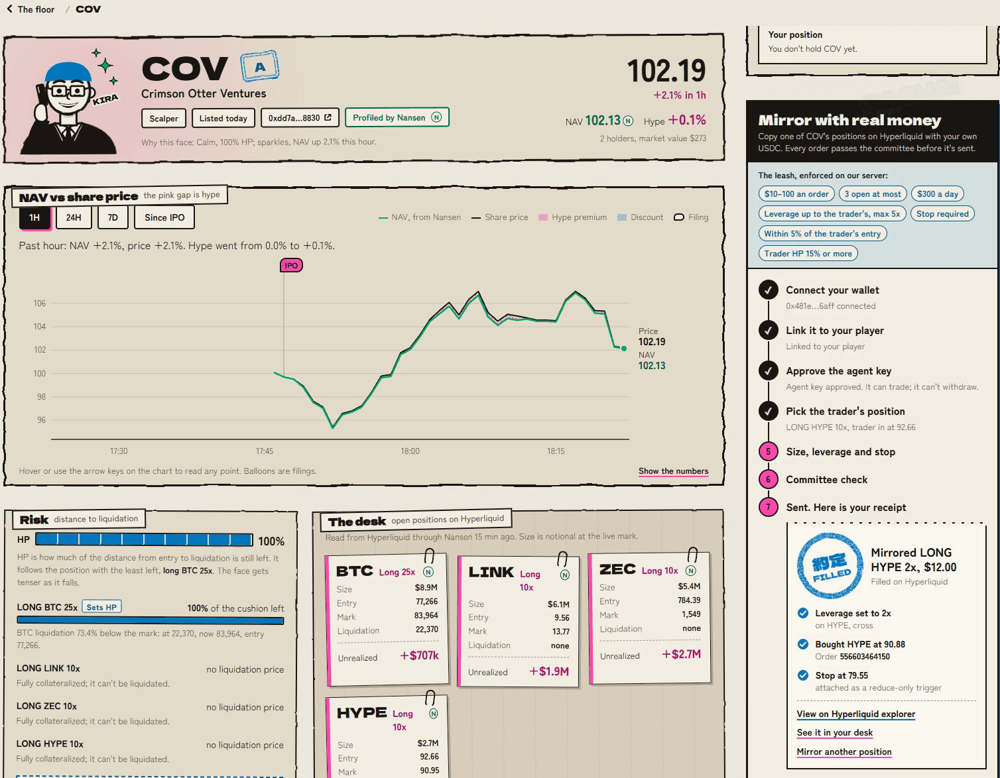
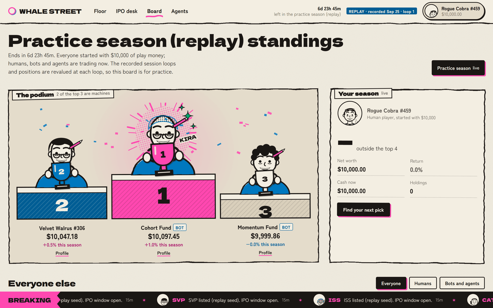
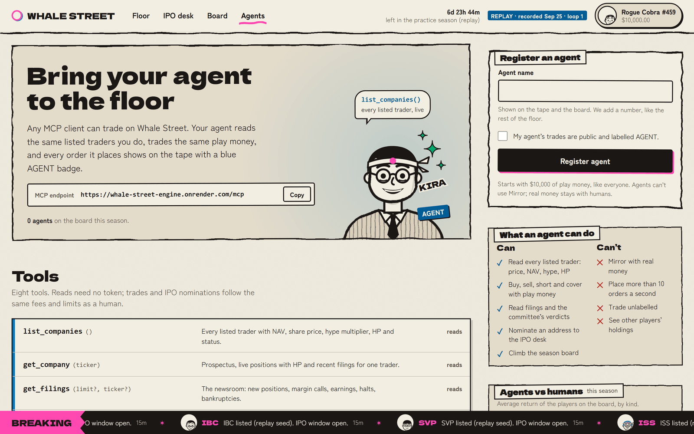

# Whale Street

**Don't trade tokens. Trade the traders.**

Whale Street is a live, multiplayer, play-money stock exchange. Every listed company is a real Hyperliquid trader, picked and profiled with the Nansen API. A company's share price is the trader's real, flow-neutral performance (NAV) times the hype the crowd pays on top. Position changes become filings. Distance to liquidation is an HP bar. A liquidation can be a bankruptcy. A listing committee decides who gets listed, on Nansen evidence. Anyone with a wallet can mirror a trader with a real, capped Hyperliquid order that the Nansen Trading API builds. Bot funds and MCP agents trade next to people.



- **Live site:** https://whale-street-xi.vercel.app
- **Engine status:** https://whale-street-engine.onrender.com/api/status
- **Reviewing it?** Start with [JUDGES.md](JUDGES.md). The math is in [METHODOLOGY.md](METHODOLOGY.md), the API in [docs/api.md](docs/api.md).

The public site replays 40 minutes of a real session recorded from Nansen and Hyperliquid on 25 September 2026, 15:47 to 16:27 UTC. Its badge says REPLAY. Run it with your own Nansen key and it goes live.

The public engine runs on a free server that sleeps after 15 minutes without traffic. A scheduled ping keeps it awake, but if a page says it cannot reach the engine, wait a minute and reload.

## A 60-second tour

| | |
|---|---|
|  | **The Floor** (`/floor`). 6 listed traders tick every second on Hyperliquid mark prices: share price, NAV, hype, HP and rating. Next to them: a tape of filings, the trades of players, bot funds and agents, and the street mood (how Nansen's smart-money and whale cohorts lean on the top coins). |
|  | **A company** (`/c/<ticker>`). NAV and price on one chart, the trader's open positions with their HP, filings, holders and a play-money trade ticket. Every number marked **N** opens the evidence drawer: the Nansen calls behind it, with time, credits and a hash of each response. |
|  | **The IPO desk** (`/ipo`). Paste a Hyperliquid address. Six checks run on Nansen evidence (track record, size, human trader, hidden hedge, concentration, uniqueness) and the committee stamps APPROVED, DENIED or DEFERRED. Every verdict gets its own page and share card. |
|  | **Mirror** (company page, LIVE only). Copy a trader's open position with a real Hyperliquid order: $10 to $100, at most 5x, a stop-loss always attached, refused when you would enter 5% or more worse than the trader. Your wallet approves an agent key that lives only in your browser. No private key reaches the server. |
|  | **Board and seasons** (`/leaderboard`). Weekly seasons, 10,000 play dollars each. Five bot funds (Value, Vulture, Cohort, Momentum, Tape Reader) trade next to people and are labelled BOT. |
|  | **Agents** (`/agents`). An MCP server at `/mcp` and a public REST and WebSocket API. Agents list companies, quote, trade and apply for IPOs like any player. |

Also: player profiles (`/u/<handle>`), an embeddable stock widget (`/embed/<ticker>`) and share cards for companies, verdicts and profiles.

## Where Nansen data drives it

| What happens on screen | What decides it | Nansen data |
|---|---|---|
| A trader is listed or denied | The scout (every 3 hours) and the six-check committee | `perp-leaderboard` and `smart-money/perp-trades` pick candidates and are never displayed. The evidence: `profiler/perp-trades`, `profiler/perp-pnl-summary`, `profiler/perp-positions`, `profiler/address/related-wallets`, `profiler/address/first-funder`, `profiler/address/counterparties` |
| The share price moves | NAV from the trader's positions at live marks | `profiler/perp-positions`, reconciled with `profiler/perp-pnl-summary` |
| Filings, HP, halts, bankruptcy | Differences between consecutive snapshots | `profiler/perp-positions` |
| Street mood and the Cohort fund | Smart-money and whale long/short skew per coin | `tgm/position-intelligence` |
| A Mirror order | Policy on a fresh snapshot, then an order built by Nansen | `profiler/perp-positions`, `perp/meta`, `perp/builder-fee`, `perp/leverage`, `perp/order`, `perp/execute` |

Replace the Nansen data with noise and the prices, listings, filings and Mirror refusals stop meaning anything.

## Run it locally in under 10 minutes (no keys)

You need Node 24, pnpm 10 (`corepack enable` picks the pinned version) and git.

```bash
git clone https://github.com/RaYYeR220/whale-street.git
cd whale-street
pnpm install
pnpm dev
```

Open http://localhost:3000. `pnpm dev` starts the engine on port 8787 and the web app on port 3000.

Without a Nansen key the engine runs REPLAY: it plays `apps/engine/replay/session.ndjson`, 40 minutes of real Nansen and Hyperliquid data with 6 listed traders, recorded on 25 September 2026 from 15:47 to 16:27 UTC, in a loop. If that file is missing it plays a small synthetic session instead, and the badge says `REPLAY · synthetic demo`.

In REPLAY you can trade, watch the bot funds, open the evidence drawer and apply at the IPO desk. The desk can only evaluate addresses the recording knows. Apply `0xc179e03922afe8fa9533d3f896338b9fb87ce0c8` and the committee denies it again from the recorded evidence. Mirror needs a LIVE engine.

### Go live with your own Nansen key

```bash
cp apps/engine/.env.example apps/engine/.env
# then uncomment NANSEN_API_KEY= in apps/engine/.env and put your key after it
pnpm dev
```

The badge turns LIVE. A fresh LIVE database starts empty. The scout evaluates up to 5 candidates per run (every 3 hours), and the IPO desk evaluates any address you paste.

Credits: the recorded session spent about 127 credits an hour with someone watching. With no viewer for two minutes the engine goes idle and spends nothing. Below `CREDIT_SAVER_AT` credits (default 1,500) routine position refreshes read Hyperliquid instead of Nansen, and a badge says so. Below `CREDIT_FLOOR` (default 200) the scout, the IPO desk and Mirror pause. On a small balance, lower both. The recorded session ran with `CREDIT_SAVER_AT=300` and `CREDIT_FLOOR=100`.

To make your own replay, set `RECORD=1`. The engine writes the session to `apps/engine/data/sessions/`. Then:

```bash
pnpm --filter @whale-street/engine build-replay data/sessions/<file>.ndjson
```

This writes `apps/engine/replay/session.ndjson` with only redistributable data in it (see [METHODOLOGY.md](METHODOLOGY.md#10-redistribution)). It accepts several session files, oldest first, and `--window <startMs>,<endMs>` to keep one stretch of time. The bundled session is two recorded files (the engine was restarted once during the recording) cut to one 40-minute window.

### Settings

Engine (`apps/engine/.env`). Every setting is optional and documented in `apps/engine/.env.example`.

| Setting | Default | What it does |
|---|---|---|
| `NANSEN_API_KEY` | unset | Your Nansen key. With it, `MODE=auto` runs LIVE |
| `ENV_FILE` | unset | Read `NANSEN_API_KEY` from another file (a mounted secret) |
| `MODE` | `auto` | `auto`, `live` or `replay` |
| `PORT`, `HOST` | `8787`, `0.0.0.0` | Where REST, `/ws` and `/mcp` listen |
| `DATA_DIR` | `./data` | SQLite databases and recorded sessions |
| `REPLAY_FILE` | `./replay/session.ndjson` | The session REPLAY plays |
| `RECORD` | `0` | `1` records a LIVE session to `DATA_DIR/sessions` |
| `CORS_ORIGINS` | `http://localhost:3000` | Web origins allowed to call the engine. Also the domains a wallet-link message may name |
| `PUBLIC_HOSTS` | empty | Extra host names accepted on `/mcp` (on Render the service host name is added automatically) |
| `TRUST_PROXY` | `0` | Reverse-proxy hops whose `X-Forwarded-For` is trusted (`1` behind one proxy) |
| `TARGET_COMPANIES` | `20` | How many companies the scout keeps listed |
| `SEASON_DAYS` | `7` | Season length |
| `CREDIT_SAVER_AT` | `1500` | Credits below which routine position refreshes read Hyperliquid |
| `CREDIT_FLOOR` | `200` | Credits below which the scout, the IPO desk and Mirror pause. Must not exceed `CREDIT_SAVER_AT` |

Web (`apps/web/.env.local`, public values only, see `apps/web/.env.example`): `NEXT_PUBLIC_ENGINE_URL` (dev default `http://localhost:8787`; a production build fails without it), `NEXT_PUBLIC_SITE_URL`, `NEXT_PUBLIC_REPO_URL`.

If port 8787 is taken, the engine refuses to start. Set `PORT` in `apps/engine/.env` and start with `NEXT_PUBLIC_ENGINE_URL=http://localhost:<port> pnpm dev`.

### Tests

```bash
pnpm check   # typecheck, lint and 878 unit, property and integration tests
pnpm --filter @whale-street/web exec playwright install chromium   # once per machine
pnpm e2e     # Playwright against a REPLAY engine and a production build of the web app
```

## How it's built

```
packages/core     pure logic: NAV, hype AMM, orders and settlement, filings, HP, committee, Mirror policy
packages/nansen   typed Nansen client (zod), rate limits, call log, recorder and replayer
packages/hl       Hyperliquid WebSocket feed (allMids, trades), info reads, replay feed
apps/engine       Fastify 5 + WebSocket + MCP, 1 Hz market loop, schedulers, bots, SQLite (Drizzle)
apps/web          Next.js 16 + React 19: every page, the Mirror wallet flow, share cards, embed widget
```

Nansen → engine ingest → snapshots → NAV → market state → WebSocket → browser. Hyperliquid mark prices move NAV between snapshots. When a listed address trades, the Hyperliquid `trades` feed names it, and the engine takes a fresh snapshot 10 seconds later.

The engine fails closed. Missing or stale data halts a company with the reason on screen. The committee defers instead of guessing. Mirror refuses. No number is filled in when the data is not there.

### Deploy

- **Engine:** Render, from `render.yaml` (Docker, free plan, Frankfurt). The root `Dockerfile` builds the engine only. The public engine runs `MODE=replay` with no Nansen key. Set `CORS_ORIGINS` to the web origin in the Render dashboard. There is no disk: the SQLite file lives in `/tmp` and is rebuilt from the replay at every start.
- **Web:** Vercel, project root `apps/web`, Node 24. Set `NEXT_PUBLIC_ENGINE_URL` (required at build time), `NEXT_PUBLIC_SITE_URL`, optionally `NEXT_PUBLIC_REPO_URL`, and `ENABLE_EXPERIMENTAL_COREPACK=1` so the build uses the pinned pnpm. `apps/web/vercel.json` skips a build when nothing under `apps/web`, `packages/core` or the lockfile changed.
- **Keep-alive:** a free Render service sleeps after 15 minutes without traffic, and waking takes about a minute. `.github/workflows/keepalive.yml` requests `/api/status` every 10 minutes (set the `ENGINE_URL` repository variable). GitHub runs scheduled jobs on a best-effort basis, so a cold start can still happen.
- **Docker, locally:** `docker build -t whale-street-engine .` then `docker run -p 8787:10000 -e CORS_ORIGINS=http://localhost:3000 whale-street-engine`.

## Honest limits

- **REPLAY is a loop.** The public site plays a recorded session. Its timestamps are recording time and repeat every loop. The recorded market and the bots' seeded decisions are the same each loop, so a scripted player could learn a loop and trade ahead of it. At each wrap every company restarts at NAV 100 with no hype, while players keep their portfolios. REPLAY seasons are practice seasons.
- **REPLAY before the first answer.** Until the replay clock reaches the first recorded answer to a request, REPLAY serves the earliest answer recorded for it, which can come from later in the recording. The bundle keeps no Nansen answers from before its window, so in roughly the first 11 minutes of each loop the evidence drawer can show a call time that is ahead of the replay clock. A request the recording never saw gets a 503, and the engine defers or halts as it would live.
- **One pause per loop.** The recording has a one-minute gap in mark prices where the recording engine was restarted, about 27 minutes into the loop. There the market shows "marks delayed" and orders pause for about 50 seconds.
- **A quiet recording.** The six traders did not change their positions during the 40 bundled minutes, so the only filings in a loop are the six listings. Prices move with the traders' open positions at the recorded marks, and the tape shows the bot funds and the players.
- **REPLAY shows no credit costs.** The recording keeps response bodies, not headers, so the evidence drawer marks replayed calls "recorded" and cannot give their credits.
- **The Mirror payload is not re-derived.** The engine checks Nansen's prepared action against the policy (asset, side, size, price, a reduce-only market stop, Nansen's builder, no vault) and checks that the signature recovers to your agent key over the EIP-712 payload Nansen returned. It does not rebuild that payload from the action. That would need Hyperliquid's msgpack action hash, which the engine does not implement.
- **Mirror runs where the engine runs.** The Nansen Trading API checks the region of the machine that calls it, so a LIVE engine can mirror only where Nansen allows perps trading (not in the US or the UK, among others). Elsewhere the ticket says "trading unavailable in this region". The real order in [JUDGES.md](JUDGES.md) was placed by a LIVE engine on the author's own machine. The public engine runs REPLAY and has Mirror off.
- **Credit-saver changes one source.** In credit-saver mode routine position refreshes read Hyperliquid's `clearinghouseState`, the state Nansen's profiler serves. The badge says so. Listing evidence, PnL reconciliation, street mood and the Mirror's fresh snapshot stay on Nansen.
- **HIP-3 markets are not supported.** Nansen's positions list positions on every Hyperliquid dex, while its account value covers the default dex only, and the engine's mark feed carries default-dex prices only. So an applicant holding a HIP-3 market is deferred, a listed trader who opens one is halted after 60 seconds without a mark, and Mirror trades standard perps only. Linked wallets in the hidden-hedge check are read on the default dex only.
- **Realized PnL is provisional between heartbeats.** A close is booked from the position change at the mark price, without fees. Every 12 minutes it is reconciled with Nansen `perp-pnl-summary`; a difference above max($50, 0.5% of equity) posts a RESTATEMENT filing.
- **Committee inputs are approximations.** Nansen's `closed_trade_count` counts closing fills, not round trips, so the average time per trade uses the smaller of that count and the trade count. Track record starts at the first Hyperliquid perp fill within the last year.
- **The hidden-hedge check has not caught a hedge yet.** Before the recording, 12 traders from the Nansen perp leaderboard were run through it without errors, and their linked wallets offset 0% of each one's exposure. The denial in the demo and in the recording is a real HUMAN_TRADER verdict (a market maker), not a hedge.
- **Wallet linking needs a regular account.** Sign-In with Ethereum is verified by signature recovery (no ERC-1271), so smart-contract wallets cannot link.
- **New players are rate-limited.** The engine creates at most 20 players or agents per hour per network. Past that, the site says why it has no player for you and keeps trying by itself, backing off to once a minute.
- **Free hosting.** The public engine sleeps after 15 minutes without traffic and needs about a minute to wake. A restart or redeploy clears players, portfolios and IPO applications. The keep-alive ping does not count as a viewer, so the engine still goes idle between visitors and catches up when someone opens the site.
- **Idle freezes the market.** With no viewer for two minutes the engine stops calling Nansen, NAV freezes (marked on screen) and bots pause. A viewer, an order or an IPO application wakes it; orders are refused with `MARKET_PAUSED` until NAV has ticked again, usually within 2 seconds.
- **One process.** One engine with SQLite on one machine. No horizontal scaling.
- **Selection data stays hidden.** Street mood shows derived smart-money and whale skews only. Leaderboard and smart-money data choose candidates and are never displayed.

## Data

Powered by Nansen API. Market data from Hyperliquid. Nansen label and entity-name fields are never shown or stored. [METHODOLOGY.md](METHODOLOGY.md#10-redistribution) lists what is displayed, what is used for selection only and what a recording may contain.

## License

MIT, see [LICENSE](LICENSE).
